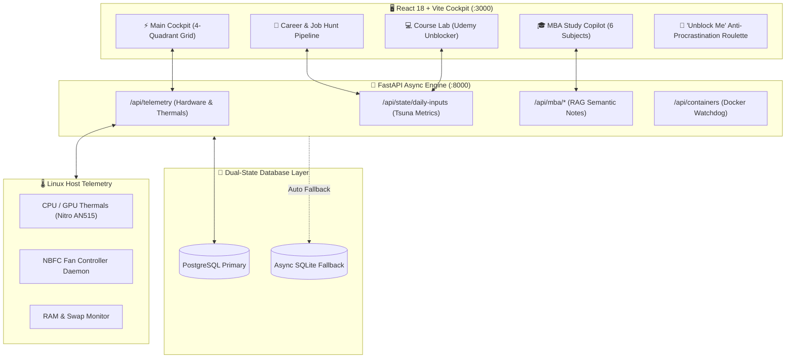

# ⚡ SM COMMAND CENTER & TRI-TRACK PRODUCTIVITY OS

[](https://www.typescriptlang.org/)
[](https://reactjs.org/)
[](https://vitejs.dev/)
[](https://fastapi.tiangolo.com/)
[](https://www.python.org/)
[](https://tailwindcss.com/)
[](https://kernel.org/)

> **A futuristic, unified local cockpit designed for engineers navigating high-intensity dual-track commitments:** balancing **Job Hunting**, **MBA Coursework (NMIMS Sem 1)**, and **Technical Skill Backlogs (Udemy)** while maintaining peak biological focus and zero-friction execution.

---

## 🌟 Architecture & System Overview



---

## 🚀 Key Modules & Feature Highlights

### 1. 💼 Career & Job Hunt Launchpad
- **Interactive Kanban Pipeline:** Track applications across 5 stages (`Targeted` $\rightarrow$ `Resume Tailored` $\rightarrow$ `Outreach Sent` $\rightarrow$ `Interviewing` $\rightarrow$ `Offer`).
- **1-Click Cold Outreach Bank:** Ready-to-use, high-converting templates for LinkedIn recruiters, engineering managers, alumni coffee chats, and post-interview follow-ups.
- **Star Project Pitch Cards:** Instant copyable architecture summaries, tech stacks, and quantitative impact metrics.

### 2. 💻 Course Lab & Udemy Unblocker
- **1 Video = 1 Code Snippet Protocol:** Eliminates tutorial fatigue by transforming monolithic 30-hour courses into 10-minute micro-sprints.
- **10-Min Sprint Studio:** Integrated code editor with live countdown timer, commit message staging, and instant celebratory feedback.
- **AI Cheat-Sheet Generator:** Bypasses passive video watching by generating 3-bullet mental models, 5-minute code challenges, and active recall drills for any topic.

### 3. 🎓 MBA Study Copilot (NMIMS Sem 1)
- **6 Core Module Hub:** Financial Accounting, Quantitative Methods, Micro/Macro Economics, Organizational Behavior, Marketing Management, and Business Communication.
- **RAG Semantic Search:** Real-time semantic retrieval over academic lecture notes and formulas with cited references.

### 4. 🎲 Anti-Procrastination Roulette (<3-Min Protocol)
- Pinned in the Header and Q1 inputs. When decision fatigue strikes, one click rolls a single **sub-3-minute micro-task** across your 3 tracks, launching a focused timer with @Tsuna's low-friction coaching tips.

### 5. 🎯 Tri-Track Daily Controllable Inputs (@Tsuna Engine)
- Unified **Daily Momentum Score (0–100%)** tracking:
  - 💼 *Job Applications & Outreach*
  - 💻 *Udemy / Code Micro-Sprints*
  - 🎓 *MBA Flashcard & Formula Recall*
  - ⚡ *90-min Deep Dev Blocks*
- **7-Day Contribution Streak Heatmap** (GitHub-style) to build compounding consistency.

### 6. ⚡ Cognitive Energy & Nervous System (@Sky Engine)
- 90-minute ultradian focus timer with 10-minute context-switch buffers.
- Interactive **Physiological Sigh (30s)** and **4-7-8 Breathwork** modals for autonomic nervous system regulation.
- **Dynamic Energy Switcher:** [🌅 Morning Peak | ☀️ Midday Build | 🌙 Evening Diffuse].

### 7. 🖥️ Hardware Watchdog & Laptop Thermals
- Real-time CPU/GPU thermals, RAM/Swap metrics, and power draw for Acer Nitro AN515.
- Integrated **NBFC Linux Fan Profile Selector** (Auto / Performance / Quiet).
- **Clean Dev Mode:** 1-click Docker memory reclamation freeing up to 1.4GB RAM.

---

## 🏛️ Virtual Advisory Board Integration

The system natively embeds persona-driven coaching from Saransh's curated Advisory Board:

| Advisor | Domain | Role & Behavioral Directive |
| :--- | :--- | :--- |
| **🎓 @Ren** | System Design, Neuro-Learning & MBA Synthesis | Enforces Active Recall, Feynman 3-Stage Explanations, and business KPI translation. |
| **⚡ @Sky** | Neuroscience of Focus & Nervous System | Regulates 90-min ultradian cycles, dopamine baselines, and physiological calm. |
| **🎯 @Tsuna** | Frictionless Productivity & Execution | Enforces the 5-Minute Rule, anti-overengineering, and sub-2-minute starting tasks. |

---

## 🛠️ Project Structure

```text
├── command-center/               # 🖥️ React 18 + Vite + TypeScript Frontend
│   ├── src/
│   │   ├── components/
│   │   │   ├── career/           # Kanban Pipeline & Outreach Bank
│   │   │   ├── courses/          # Course Lab & 10-Min Sprint Studio
│   │   │   ├── mba/              # MBA Study Copilot & Markdown Viewer
│   │   │   ├── modals/           # Roulette, Breathwork, Micro-Start, CleanDev
│   │   │   ├── quadrants/        # Q1 (Inputs), Q2 (Gym), Q3 (Hardware), Q4 (Energy)
│   │   │   ├── Header.tsx        # 4-Way Nav, Energy Switcher, Roulette trigger
│   │   │   ├── ControlHub.tsx    # AGY Telemetry & Diagnostic launcher
│   │   │   └── FloatingDock.tsx  # Quick Advisor summoning dock
│   │   ├── context/              # DashboardContext (Unified state & fallback)
│   │   ├── data/                 # Mock & Seed datasets (Career, Courses, DSA, MBA)
│   │   ├── types/                # Strict TypeScript interface contracts
│   │   └── App.tsx               # Root view router & layout container
│   ├── package.json
│   └── vite.config.ts
│
├── command_center_backend/       # 🔌 FastAPI Asynchronous Python Backend
│   ├── routers/
│   │   ├── telemetry.py          # Host CPU/GPU/Fan telemetry collector
│   │   ├── system.py             # NBFC fan profile switcher
│   │   ├── containers.py         # Docker orchestrator
│   │   ├── state.py              # Daily controllable inputs state
│   │   └── mba.py                # MBA semantic notes & RAG router
│   ├── database.py               # Async SQLAlchemy with SQLite fallback
│   ├── main.py                   # App lifecycle & CORS middleware
│   └── requirements.txt
│
├── start_command_center.sh       # 🚀 1-Command Unified Bash Launcher
└── launch.py                     # 🐍 Cross-Platform Python Launcher
```

---

## ⚡ Quickstart & Installation

### Prerequisites
- Node.js $\ge$ 18.x
- Python $\ge$ 3.10
- Linux x86_64 (Ubuntu / Debian / Arch)

### 1-Command Launch
To start both the FastAPI backend (`:8000`) and the Vite React frontend (`:3000`) concurrently:

```bash
bash /home/saransh/start_command_center.sh
```
*or via Python:*
```bash
python3 /home/saransh/launch.py
```

### Manual Development Setup

#### 1. Backend Setup
```bash
cd /home/saransh/command_center_backend
python3 -m venv venv
source venv/bin/activate
pip install -r requirements.txt
python -m uvicorn main:app --host 0.0.0.0 --port 8000 --reload
```

#### 2. Frontend Setup
```bash
cd /home/saransh/command-center
npm install
npm run dev -- --host 0.0.0.0 --port 3000
```

---

## 🌐 Endpoints & URLs

- **🖥️ Web Dashboard:** [http://localhost:3000](http://localhost:3000)
- **🔌 Backend API:** [http://localhost:8000](http://localhost:8000)
- **📚 Interactive Swagger Docs:** [http://localhost:8000/docs](http://localhost:8000/docs)
- **🩺 Health Check:** [http://localhost:8000/api/health](http://localhost:8000/api/health)

---

## 👤 Author & Architecture Lead
**Saransh Mathur**  
*Backend & AI Systems Engineer • MBA Candidate (NMIMS Sem 1)*  
- GitHub: [@saranshmathur](https://github.com/saranshmathur)

---

## 📄 License
MIT License © 2026 Saransh Mathur. All rights reserved.
